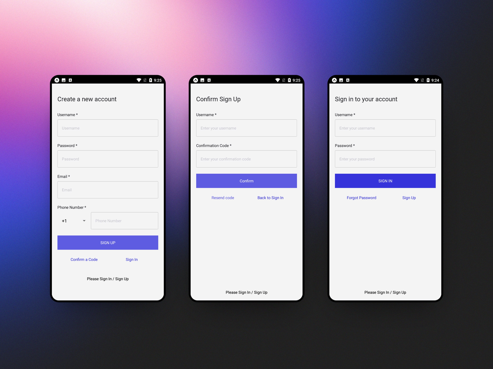
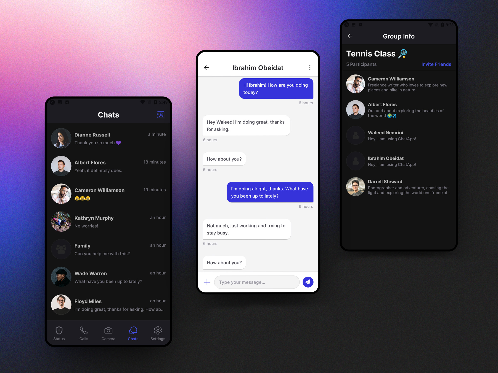
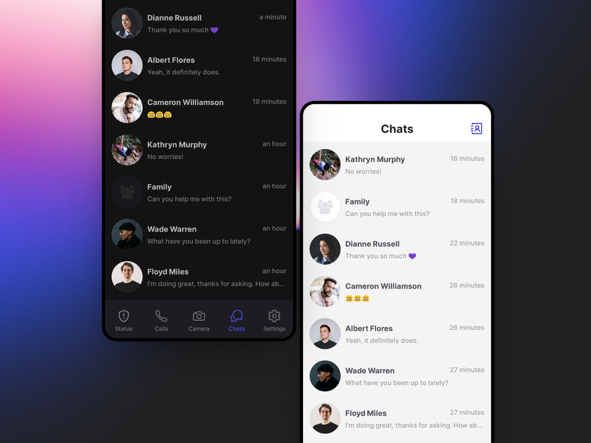
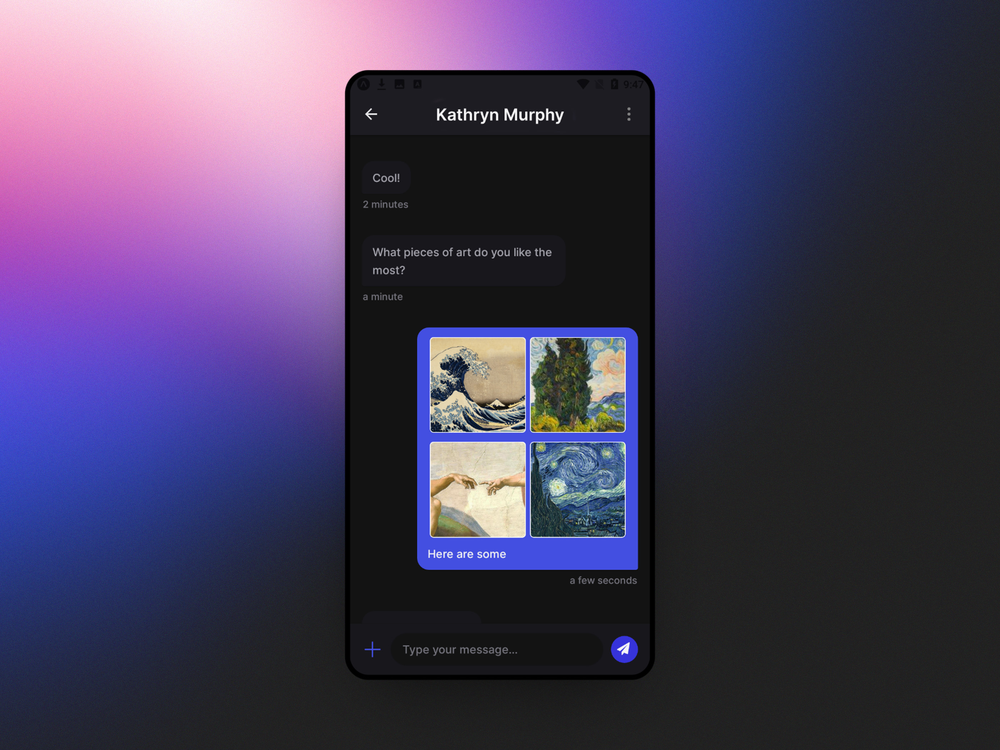
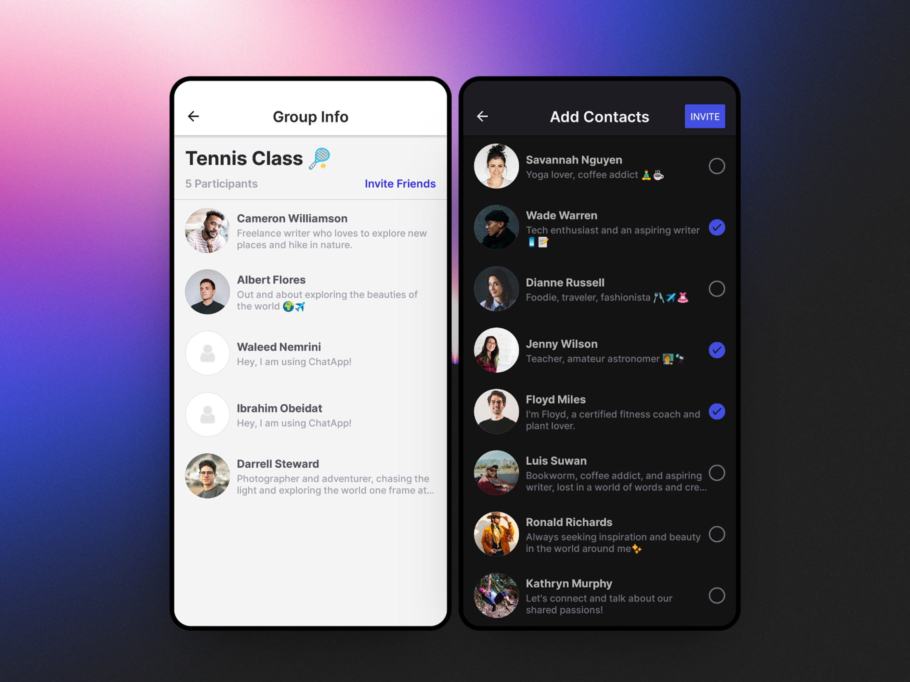

<div align="center">
  
</div>

# ChatApp
Chat app is a modern chat application for Android and IOS which enables users to send and receive text messages, create groups, and share photos with their friends in real-time. ChatApp makes it easier, simpler, and faster to connect with everyone and it is also easy to use.

## Table of Content
  * [Architecture](#architecture)
  * [Features](#features)
  * [User Guide](#user-guide)
  * [Installation](#installation)
  * [Contributing](#contributing)

## Architecture
##### Frontend
The frontend is built using React Native, React Navigation, React Context, JavaScript, HTML, and CSS.
##### Backend
The backend is built using AWS Amplify, which provides a set of pre-built backend services like authentication, database, storage, and real-time data synchronization. The backend is deployed on Amazon Web Services (AWS) and uses Amazon Cognito for user authentication, Amazon DynamoDB for storing chat messages, and Amazon S3 for storing photos. The real-time data synchronization is provided by AWS AppSync and AWS Amplify DataStore.

The frontend communicates with the backend using a set of RESTful APIs provided by AWS Amplify.

## Features
- ##### Full Authentication with Email Verification
  
- ##### Minimalistic & Elegant UI/UX
  
- ##### Dark Theme Support
  
- ##### Photo Sharing
  
- ##### Group Chat Support
  
- ##### Realtime Data Syncing and More...

## User Guide
To use the app, follow these steps:
1. Open the app and create an account using your email address.
2. Verify your email address by entering the code you receive in the email.
3. Log in to the app using your email address and password.
4. On the main chat screen, you can see a list of your recent chats (It will be empty upon first login).
5. To start a new chat, click on the contacts icon in the right of the upper tab and click on the person you want to chat with.
6. To create a group chat, click on the "New Group" button. Then enter the group name and select the people you want to add to the group.
7. To send a message, type your message in the input field at the bottom of the screen and press the "Send" button.
8. To share a photo, click on the plus icon on the left of the input field and select the photo you want to share from your gallery.

## Installation
To install the app on your local machine, follow these steps:
 1. Clone the GitHub repository:
    ```
    git clone <repository_url>
    ```
 2. Install the dependencies:
    ```
    cd ChatApp
    npm install
    ```
 3. Start the app:
    ```
    npm start
    npx react-native run-ios for IOS
    npx react-native run-android for Android
    ```

## Contributing
Pull requests are welcome. For major changes, please open an issue first to discuss what you would like to change.